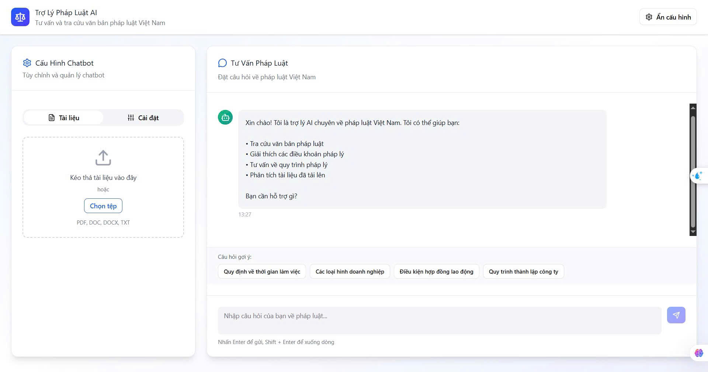
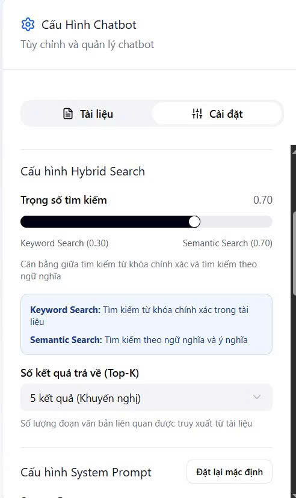

# ChatBot Luật Việt Nam (VietLawBot)

VietLawBot — trợ lý chat pháp luật tiếng Việt, hỗ trợ tra cứu điều luật, giải thích ngôn ngữ pháp lý và soạn thảo văn bản cơ bản. README này được chia làm rõ ràng: Backend (FastAPI) và hai lựa chọn Frontend (Streamlit — Python UI, hoặc Web UI bằng npm — React/Vite/...).

---
### Kiến trúc hệ thống


## 📸 Demo Giao Diện

### 1. Giao diện Chatbot (User Interface)
*Nơi người dùng đặt câu hỏi và nhận tư vấn từ AI. Giao diện được tối ưu hóa cho trải nghiệm đọc hiểu văn bản luật.*


*(Lưu ý: Đảm bảo bạn đã upload ảnh vào thư mục `img` trong repo)*

### 2. Giao diện Cấu hình Hệ thống (Admin/Config Dashboard)
*Bảng điều khiển dành cho quản trị viên để thiết lập luồng xử lý (Flow), tinh chỉnh tham số mô hình và quản lý kết nối API.*



---

## Mục lục
- [Tổng quan](#tổng-quan)
- [Yêu cầu hệ thống chung](#yêu-cầu-hệ-thống-chung)
- [Cấu trúc dự án (tóm tắt)](#cấu-trúc-dự-án-tóm-tắt)
- [Backend (API) — FastAPI](#backend-api---fastapi)
  - [Yêu cầu](#yêu-cầu)
  - [Cấu hình môi trường (.env mẫu)](#cấu-hình-môi-trường-env-mẫu)
  - [Chạy (local / Docker)](#chạy-local--docker)
  - [Docs API](#docs-api)
- [Frontend Option A — Streamlit (Python UI)](#frontend-option-a---streamlit-python-ui)
  - [Yêu cầu & Chạy](#yêu-cầu--chạy)
- [Frontend Option B — Web UI (npm) — React / Vite / Next / Vue](#frontend-option-b---web-ui-npm---react--vite--next--vue)
  - [Yêu cầu](#yêu-cầu-1)
  - [Cấu hình môi trường cho frontend (ví dụ dùng Vite/React)](#cấu-hình-môi-trường-cho-frontend-ví-dụ-dùng-vitereact)
  - [Chạy local (development)](#chạy-local-development)
  - [Build production & serve](#build-production--serve)
  - [Dockerfile cho frontend (gợi ý)](#dockerfile-cho-frontend-gợi-ý)
- [Chạy cả frontend + backend bằng Docker Compose](#chạy-cả-frontend--backend-bằng-docker-compose)
- [Triển khai & Bảo mật](#triển-khai--bảo-mật)
- [Đóng góp](#đóng-góp)
- [Liên hệ](#liên-hệ)

---

## Tổng quan
Mục tiêu: cung cấp một bot chat tiếng Việt chuyên về luật, gồm:
- Backend: API (FastAPI) xử lý truy vấn, gọi LLM, truy xuất cơ sở dữ liệu pháp luật.
- Frontend: có thể dùng Streamlit (nhanh, cho demo) hoặc Web UI (React/Vite/Next...) được phát triển bằng npm.

---

## Yêu cầu hệ thống chung
- Docker & Docker Compose (khuyến nghị để chạy full stack).
- (Tùy chọn) Python 3.10+ nếu chạy backend / Streamlit local.
- (Tùy chọn) Node.js >= 16 + npm hoặc yarn nếu dùng frontend bằng npm.
- (Tùy chọn) PostgreSQL (hoặc chạy trong Docker Compose).

---

## Cấu trúc dự án (tóm tắt)
- app/           — mã nguồn backend (FastAPI)
- ui/            — mã nguồn frontend Streamlit,React/Vite/Next...
- .env.example   — mẫu biến môi trường

---

## Backend (API) — FastAPI

### Yêu cầu
- Docker & Docker Compose (khuyến nghị)
- Python 3.10+ để chạy local
- (Nếu dùng DB riêng) PostgreSQL

### Cấu hình môi trường (.env mẫu)
Tạo file `.env` ở thư mục gốc với nội dung (chỉnh lại giá trị phù hợp):
```
DEBUG=false
LOG_LEVEL=INFO
LOG_SIZE_LIMIT=10MB
SERVICE_NAME=chatbot

# PostgreSQL
PG_USER=postgres
PG_PWD=your_pw
PG_HOST=localhost
PG_PORT=5432
DB_NAME=news_db

# API keys (thay bằng key thật)
GEMINI_API_KEY=your_gemini_api_key
OPENAI_API_KEY=your_openai_api_key
```
Lưu ý: Thay `your_gemini_api_key` và `your_openai_api_key` bằng API key thật. Không commit `.env` chứa bí mật lên repo.

### Chạy (local / Docker)
- Chạy local (trong virtualenv):
  ```
  # kích hoạt venv, cài dependencies
  pip install -r requirements.txt

  # chạy phát triển
  uvicorn app.api.api:app --reload
  ```
  (Điều chỉnh entrypoint `app.api.api:app` nếu cấu trúc khác.)

- Chạy bằng Docker Compose:
  ```
  docker-compose up --build
  ```

### Docs API
Khi backend chạy:
- Swagger UI: http://localhost:8000/docs
- ReDoc: http://localhost:8000/redoc

---

## Frontend Option A — Streamlit (Python UI)

### Yêu cầu & Chạy
- Python 3.10+, Streamlit trong `requirements.txt`.

- Chạy local:
  ```
  streamlit run ui/app.py --server.port 8501
  ```
- Giao diện sẽ có ở: http://localhost:8501

---

## Frontend Option B — Web UI (npm) — React / Vite / Next / Vue

Lựa chọn này phù hợp cho sản phẩm web hiện đại, SPA/SSR, dễ deploy cùng CDN.

### Yêu cầu
- Node.js >= 16 và npm hoặc yarn.
- Thư mục web/ chứa project frontend (React/Vite/Next/...).

### Cấu hình môi trường cho frontend (ví dụ dùng Vite/React)
Frontend cần biết URL backend để gọi API. Tùy framework, biến môi trường có tên khác:
- Vite: VITE_BACKEND_URL
- Create React App: REACT_APP_BACKEND_URL
- Next.js: NEXT_PUBLIC_BACKEND_URL

### Chạy local (development)
Vào thư mục `app/ui` và chạy:
```
cd app
cd ui
npm install
npm run dev          # hoặc: npm start (tùy project)
```
Sau đó mở: http://localhost:3000 (hoặc cổng dev server được project cấu hình).

### Build production & serve
- Build:
  ```
  cd app
  cd ui
  npm run build
  ```
- Serve build (nhanh) bằng serve:
  ```
  npm install -g serve
  serve -s dist -l 3000
  ```
  hoặc cấu hình Nginx để phục vụ file tĩnh `dist`/`build`.

## Triển khai & Bảo mật
- Lưu API keys trong secret manager (AWS Secrets Manager, GitHub Secrets, Vault...) thay vì `.env` trên repo.
- Production: bật HTTPS, cấu hình CORS chỉ cho phép domain frontend.
- Thêm xác thực & rate-limiting cho API public.
- Scan dependency, giữ image nhỏ, cập nhật CVE.

---

## Đóng góp
- Fork → tạo branch feature/bugfix → PR.
- Mô tả cách chạy, test case, và ảnh hưởng tới DB/schema.

---

## Liên hệ
Maintainer: macvanthanh123

---

Nếu bạn muốn, mình có thể:
- Chỉnh README theo project frontend thực tế trong `web/` (ví dụ package.json, scripts, port).
- Viết Dockerfile/Docker Compose mẫu tương thích với cấu trúc repo của bạn — gửi cho mình nội dung `docker-compose.yml`, `web/package.json`, hoặc `web/vite.config.js` để mình tạo cấu hình chuẩn.
